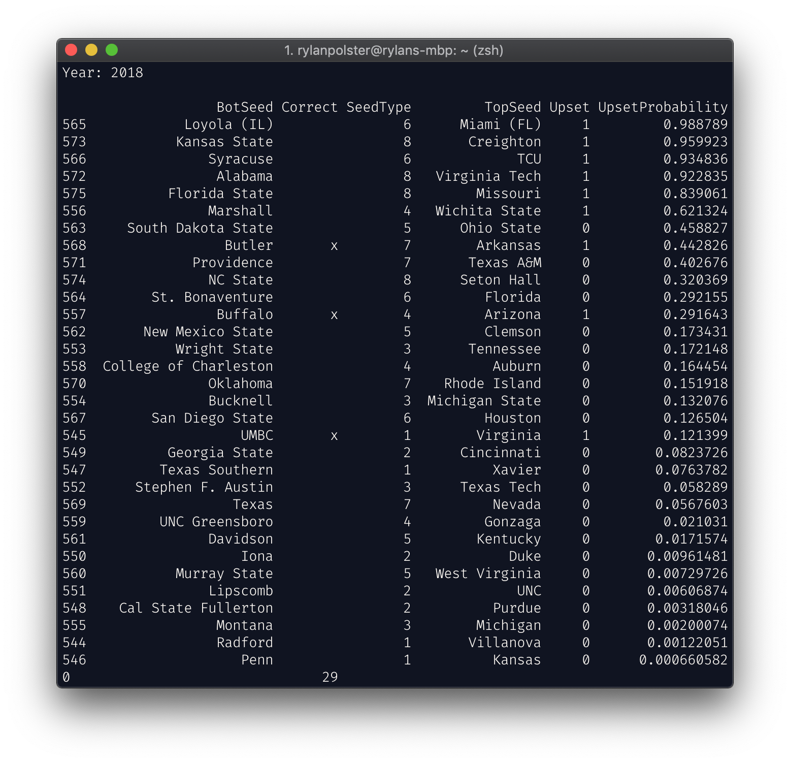
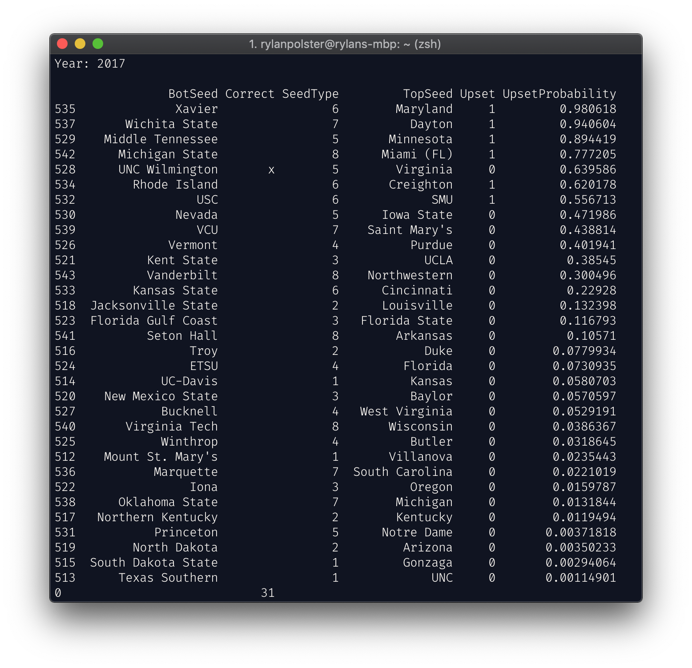

This is a statistical program designed to analyze data from past years in order to make an accurate prediction of the outcomes of this year's NCAA Tournament.

## Personal Project Info
Here are various links to the required personal project components:
- [Paper Report](https://docs.google.com/document/d/1feI2-PqSzBnh--9rehwKhATbYZ7PvGixjELN5l5ViP4/edit?usp=sharing)
- [Process Journal](https://docs.google.com/spreadsheets/d/1h-WI65uvIrwYAikDNk_hxRZNj9OSuKISbF4w9WDqAVw/edit?usp=sharing)
- [Slides Presentation](https://docs.google.com/presentation/d/1Wo9BOBGZ8AGfyWeuJZULq0ZdpC0MLKLuW81KYCbmnw8/edit?usp=sharing)

## Previous Predictions

### 2019

### 2018

### 2017

